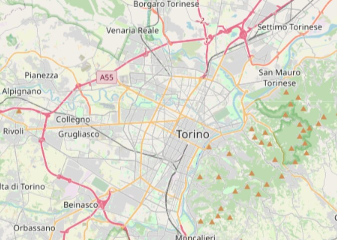
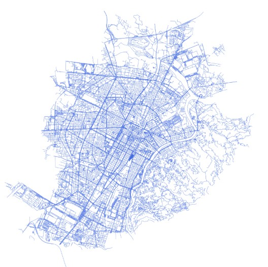
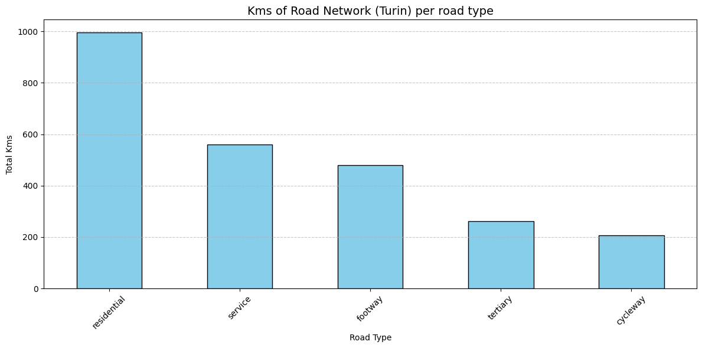
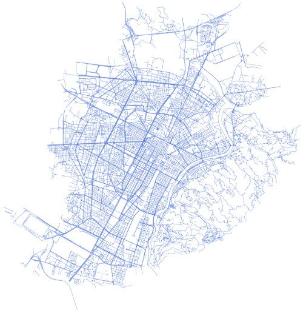
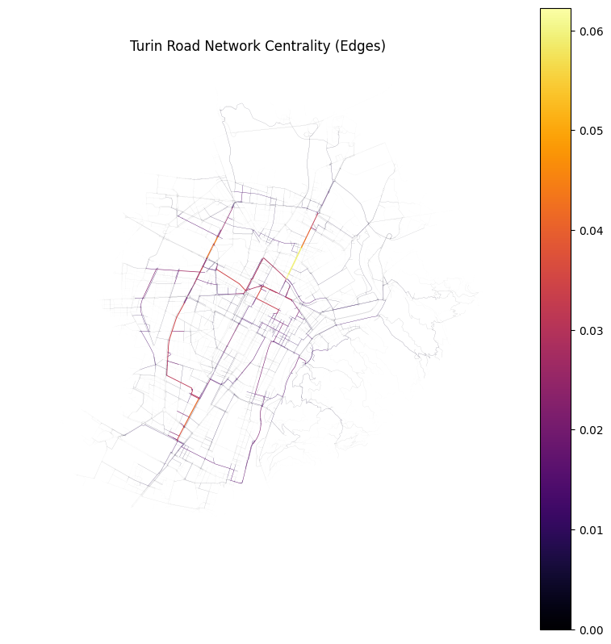

# Urban Mobility Network Analysis: Turin Case Study

This project analyzes the road network of Turin, Italy, by integrating geospatial data from **OpenStreetMap**, a **PostGIS** database for spatial storage, and **Python** for advanced graph analysis. The primary objective is to calculate centrality metrics and identify critical nodes and roads within the urban infrastructure.

<p align="center">
  
</p>

### Why Turin?

**Torino serves as a unique case study for urban mobility** due to its dualistic layout:

* **The Roman Grid**: The city center follows a highly regular, orthogonal grid, reflecting its Roman origins.
* **Industrial Expansion**: Building upon the historical core, modern development introduced complex radial arteries and ring roads, creating interesting bottlenecks where different patterns intersect.

As a major European hub, analyzing its network connectivity offers insights into the interaction between historical architecture and modern transit demands.

### Workflow Overview

* **Data Extraction**: Queried OpenStreetMap data using **QGIS** (**QuickOSM** plugin). 
* **Data Engineering**: Loaded and structured geospatial data into a relational spatial database (**PostGIS**).
* **Data Exploration & Cleaning**:
* * Performed statistical analysis of road segments.
* * Filtered out "service" and "footway" types to focus on vehicle traffic.
* * Handled topology issues (dead ends, parking areas, and inaccessible areas).
* **Graph Analysis**: Transformed geographic data into a mathematical graph to compute **centrality metrics**.
* **Visualization**: Rendered analytical results onto maps and statistical plots.

### Technical Stack

* **Database**: PostgreSQL + PostGIS.
* **Languages**: SQL, Python (3.13).
* **Python Libraries**: Pandas, GeoPandas, NetworkX, SQLAlchemy, Shapely, Matplotlib. 
* **GIS**: QGIS for data extraction and validation.

### Project Structure

* `data/`: Contains GeoJSON files used to replicate the analysis.
* `src/`: 
* * `data_exploration.ipynb`: Statistical analysis and data cleaning.
* * `db_connection_test.py`: Script for database connection testing.
* * `network_analysis.ipynb`: Computation of graph density, degree, betweenness centrality.
* `img/`: Folder storing project maps and plots.
* `requirements.txt`: List of Python dependencies.
* `LICENSE`: Project licensing information (MIT).

### Setup and Installation

**PostGIS Database** After installing PostgreSQL and PostGIS, create the database and import the road layer. Use the following snippet to enable spatial functions and calculate accurate distances:

```sql
CREATE EXTENSION postgis;

ALTER TABLE roads
ADD COLUMN length_m DOUBLE PRECISION;

UPDATE roads
SET length_m = ST_Length(geom, 32632);
```


**Python Environment**

Install the required dependencies.

    pip install -r requirements.txt

### Replicability & Reproducibility

The analysis is designed to be fully replicable by following these steps:

* **Database Reconstruction**: Populate a PostGIS instance using the raw geospatial data provided in the `data/` folder (GeoJSON format). 

* **Automated Processing**: Use the provided SQL commands to enable spatial extensions and compute road segment metrics.

* **Notebook Execution**: The *Jupyter Notebooks* in `src/` are structured to guide you through data cleaning, graph construction, and the final computation of centrality metrics.

### Key Results

By reconstructing the network via geospatial queries, we can analyze the city's backbone.

<p align="center">

</p>

A high percentage of the network consists of "service" and "footway" segments, which do not significantly impact main vehicle traffic flows. Filtering these out reduces the dataset by 43%, removing noise like parking lots and pedestrian paths.

<p align="center">


</p>

Betweenness Centrality Analysis:
We used Edge Betweenness Centrality to identify "critical corridors"—the main arteries most likely to experience heavy traffic load as they lie on the majority of shortest paths.

<p align="center">

</p>


### Future Improvements

* **Real-time Traffic Integration**: Incorporating live traffic data APIs to dynamically weight graph edges.

* **Predictive Modeling**: Using ML to forecast traffic peaks based on historical centrality.

### License

This project is licensed under the MIT License.
